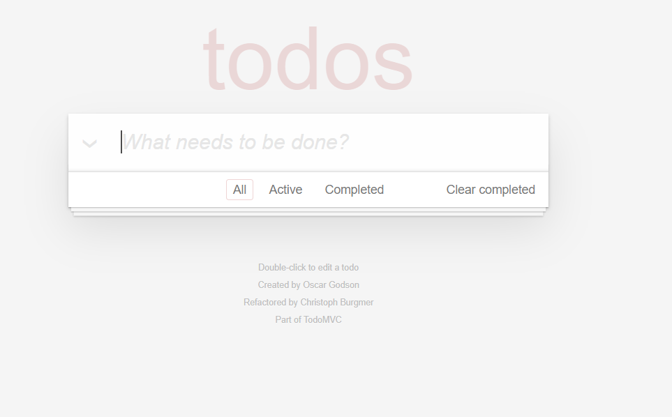

# javascript-training

# Overview
This document provides information about Javascript practice. Build ToDos List website

# Screenshots


# Technical
- HTML5/CSS3
- Javascript
- DOM manipulation
- JSON Server

# Timeline		
20 working days (Apr 25, 2022, to June 09, 2022)

# Plan
- Plan on github [project](https://github.com/Thaoha11/javascript-training/projects/1)
- [Estimation](https://docs.google.com/document/d/1K8svZLWJDcqze2Bgd8Tdpe5QSXnK2s2J/edit)

# Targets
- Selecting Elements, Getting Values, and Setting Values.
- Attributes, Classes and CSS Manipulation.
- DOM manipulation with simple table, form.
- MVC pattern

# REFERENCES
- [JSON server](https://github.com/typicode/json-server)
- [Fetch API](https://developer.mozilla.org/en-US/docs/Web/API/Fetch_API/Using_Fetch)

# Installation
- Step 1 :clone repository
```bash
git checkout branch feature/practice-1
```
- Step 2 :cd folder practice-1
```bash
cd practice-1
```
- step 3 : start JSON Server
```bash
json-server --watch db.json
```
- step 4 : run project
```bash
npm start
```
